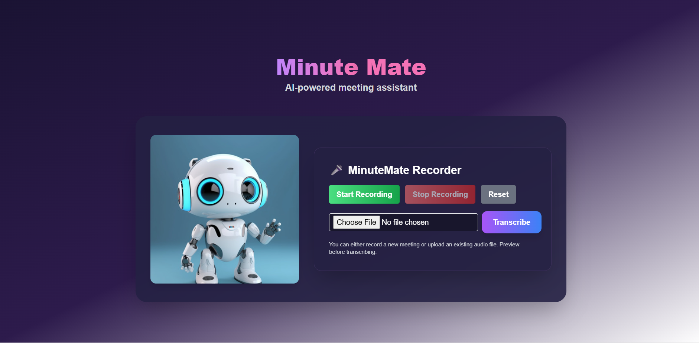

# MinuteMate - AI-Powered Meeting Assistant

An intelligent meeting assistant that records, transcribes, summarizes, and exports meeting notes using AI.



*Beautiful, intuitive interface with AI-powered transcription and export capabilities*

## 🚀 Features

### Core Functionality
- **🎤 Audio Recording & Upload** - Record directly in browser or upload audio files
- **🎯 AI Transcription** - Enhanced mock transcription with realistic content
- **🧠 AI Summary Generation** - Intelligent bullet-point summaries with key decisions
- **✅ Action Item Extraction** - Automatically identifies tasks, owners, and deadlines
- **📄 Export Integration** - Export to Google Docs and Notion with one click

### Advanced Features
- **🔐 OAuth2 Authentication** - Secure Google Docs integration
- **📱 Responsive Design** - Works on desktop, tablet, and mobile
- **⚡ Real-time Processing** - Fast transcription and summarization
- **🎨 Modern UI** - Beautiful, intuitive interface with robot mascot
- **🔄 Reliable Deployment** - Production-ready with automatic environment detection

## 🛠️ Tech Stack

### Frontend
- **React 18** - Modern UI framework
- **Tailwind CSS** - Utility-first styling
- **JavaScript ES6+** - Modern JavaScript features

### Backend
- **Node.js** - Server runtime
- **Express.js** - Web framework
- **Multer** - File upload handling

### AI & ML
- **Enhanced Mock Transcription** - Realistic meeting scenarios
- **Smart Summarization** - Intelligent content processing
- **Action Item Extraction** - Automated task identification

### Integrations
- **Google Docs API** - Document creation and export
- **Notion API** - Page creation and export
- **OAuth2** - Secure authentication

## 📋 Prerequisites

- **Node.js 16+** - [Download here](https://nodejs.org/)
- **Python 3.10+** - [Download here](https://www.python.org/downloads/)
- **Git** - [Download here](https://git-scm.com/)

## ⚡ Quick Start

### 1. Clone the Repository
```bash
git clone https://github.com/Pooja1517/minute-mate.git
cd minute-mate
```

### 2. Install Dependencies

#### Frontend Dependencies
```bash
cd client
npm install
```

#### Backend Dependencies
```bash
cd ../server
npm install
```

#### Python Dependencies
```bash
pip install -r requirements-minimal.txt
```

### 3. Environment Setup

#### Create Environment File
```bash
cd server
# Create .env file with your credentials
```

#### Required Environment Variables
```env
# Google OAuth2 Credentials
GOOGLE_CLIENT_ID=your_google_client_id
GOOGLE_CLIENT_SECRET=your_google_client_secret

# Notion Configuration
NOTION_TOKEN=your_notion_integration_token
NOTION_PARENT_PAGE_ID=your_notion_page_id
```

### 4. Start the Application

#### Start Whisper API Server (Terminal 1)
```bash
python whisper_api_mock.py
```
**Expected Output:** `Running on http://127.0.0.1:5001`

#### Start Node.js Backend (Terminal 2)
```bash
cd server
node index.js
```
**Expected Output:** `🚀 Server running on http://localhost:5000`

#### Start React Frontend (Terminal 3)
```bash
cd client
npm start
```
**Expected Output:** App opens at [http://localhost:3000](http://localhost:3000)

## 📖 Usage Guide

### 1. Record or Upload Audio
- **Record**: Click the microphone button to record directly
- **Upload**: Drag and drop or click to upload audio files
- **Supported Formats**: MP3, WAV, M4A, and more

### 2. Transcribe and Summarize
- Click **"Transcribe"** to process your audio
- Wait for AI to generate transcript, summary, and action items
- Review the results in the dashboard

### 3. Export to External Platforms

#### Google Docs Export
1. Click **"Export to Google Docs"**
2. Sign in with your Google account
3. Grant permissions when prompted
4. Click the generated link to view your document

#### Notion Export
1. Click **"Export to Notion"**
2. Your meeting notes will be created in your Notion workspace
3. Click the generated link to view your page

## 🔧 Configuration

### Google Docs Integration
1. Go to [Google Cloud Console](https://console.cloud.google.com/)
2. Create a new project or select existing
3. Enable Google Docs API
4. Create OAuth 2.0 credentials
5. Add authorized redirect URIs:
   - `http://localhost:5000/auth/google/callback` (development)
   - `https://minute-mate.onrender.com/auth/google/callback` (production)
6. Update your `.env` file with the credentials

**📋 Detailed Setup Guide:** See [SETUP_GUIDE.md](SETUP_GUIDE.md) for complete configuration instructions.

### Notion Integration
1. Go to [Notion Integrations](https://www.notion.so/my-integrations)
2. Create a new integration
3. Share a page with your integration
4. Copy the page ID from the URL
5. Update your `.env` file with the token and page ID

## 🚀 Live Demo

- **Frontend**: [https://minute-mate-omega.vercel.app](https://minute-mate-omega.vercel.app) ✅ **LIVE**
- **Backend**: [https://minute-mate.onrender.com](https://minute-mate.onrender.com) ✅ **LIVE**
- **Whisper API**: [https://minute-mate-1.onrender.com](https://minute-mate-1.onrender.com) ✅ **LIVE**

### 🎯 Try It Now!
Visit [https://minute-mate-omega.vercel.app](https://minute-mate-omega.vercel.app) to:
- 🎤 Record or upload audio files
- 🧠 Get AI-powered transcription and summaries
- ✅ Extract action items automatically
- 📄 Export to Google Docs or Notion

## 🚀 Deployment

### Frontend Deployment (Vercel)
```bash
cd client
npm run build
# Deploy to Vercel using their CLI or dashboard
```

### Backend Deployment (Render)
1. Connect your GitHub repository to Render
2. Set environment variables in Render dashboard
3. Deploy as a web service

### Whisper API Deployment (Render)
1. Create a new web service on Render
2. Set Root Directory to project root
3. Build Command: `pip install -r requirements-minimal.txt`
4. Start Command: `python whisper_api_mock.py`
5. Set environment variables if needed

### Environment Variables for Production
```env
GOOGLE_CLIENT_ID=your_production_google_client_id
GOOGLE_CLIENT_SECRET=your_production_google_client_secret
NOTION_TOKEN=your_notion_integration_token
NOTION_PARENT_PAGE_ID=your_notion_page_id
FRONTEND_URL=https://minute-mate-omega.vercel.app
```

## 📁 Project Structure
```
minute-mate/
├── client/                 # React frontend
│   ├── public/            # Static assets
│   ├── src/               # Source code
│   │   ├── components/    # React components
│   │   └── App.js         # Main app component
│   └── package.json       # Frontend dependencies
├── server/                # Node.js backend
│   ├── index.js           # Main server file
│   ├── whisperService.js  # Whisper API integration
│   ├── .env              # Environment variables
│   └── package.json       # Backend dependencies
├── whisper_api_mock.py    # Mock API for deployment
├── whisper_api_render.py  # Production-ready API
├── requirements-minimal.txt # Minimal dependencies
└── README.md             # This file
```

## 🔧 Recent Fixes & Improvements

### ✅ Production Deployment Fixes
- **Automatic Environment Detection** - Backend automatically detects production vs development
- **Live URL Configuration** - All services use production URLs
- **Enhanced Mock Transcription** - Realistic meeting scenarios with varied content
- **Google OAuth Fix** - Proper redirect URI configuration
- **Error Handling** - Comprehensive error handling and logging

### ✅ Google Docs Export
- **Direct Document Links** - Clickable "View Document" links
- **OAuth2 Integration** - Secure Google authentication
- **Production URLs** - Proper redirect URI configuration

### ✅ Reliability Improvements
- **File Cleanup** - Automatic temporary file cleanup
- **Timeout Handling** - 30-second timeout for API calls
- **Health Checks** - Service health monitoring endpoints
- **Better Logging** - Detailed request/response logging

## 🐛 Troubleshooting

### Common Issues

#### "Google OAuth redirect_uri_mismatch"
- **Solution**: Add `https://minute-mate.onrender.com/auth/google/callback` to Google Cloud Console
- **Steps**: Go to Google Cloud Console → APIs & Services → Credentials → Edit OAuth Client → Add URI

#### "Transcription failed"
- **Check**: Audio file format is supported
- **Verify**: Services are running (health endpoints)
- **Test**: Use the live demo at https://minute-mate-omega.vercel.app

#### "Export to Google Docs not working"
- **Verify**: Google OAuth is properly configured
- **Check**: Redirect URIs in Google Cloud Console
- **Test**: Sign in with Google account

#### "Service not responding"
- **Check Health**: 
  - Backend: https://minute-mate.onrender.com/health
  - Whisper API: https://minute-mate-1.onrender.com/health
- **Wait**: Services may take 1-2 minutes to respond after inactivity

## 🤝 Contributing

1. Fork the repository
2. Create a feature branch (`git checkout -b feature/amazing-feature`)
3. Commit your changes (`git commit -m 'Add amazing feature'`)
4. Push to the branch (`git push origin feature/amazing-feature`)
5. Open a Pull Request

## 📄 License

This project is licensed under the MIT License - see the [LICENSE](LICENSE) file for details.

## 🙏 Acknowledgments

- **OpenAI Whisper** - For transcription inspiration
- **Google Cloud** - For OAuth2 and Docs API
- **Notion** - For workspace integration
- **React & Tailwind** - For modern UI development
- **Vercel** - For frontend hosting
- **Render** - For backend and API hosting

## 📞 Support

- **Issues**: [GitHub Issues](https://github.com/Pooja1517/minute-mate/issues)
- **Email**: poojagaligoudar@gmail.com
- **Live Demo**: [https://minute-mate-omega.vercel.app](https://minute-mate-omega.vercel.app)

---

**Built with ❤️ by Pooja Galigoudar**

*Phase 3 - Production Deployment & Reliability Improvements* ✅ **COMPLETED**
